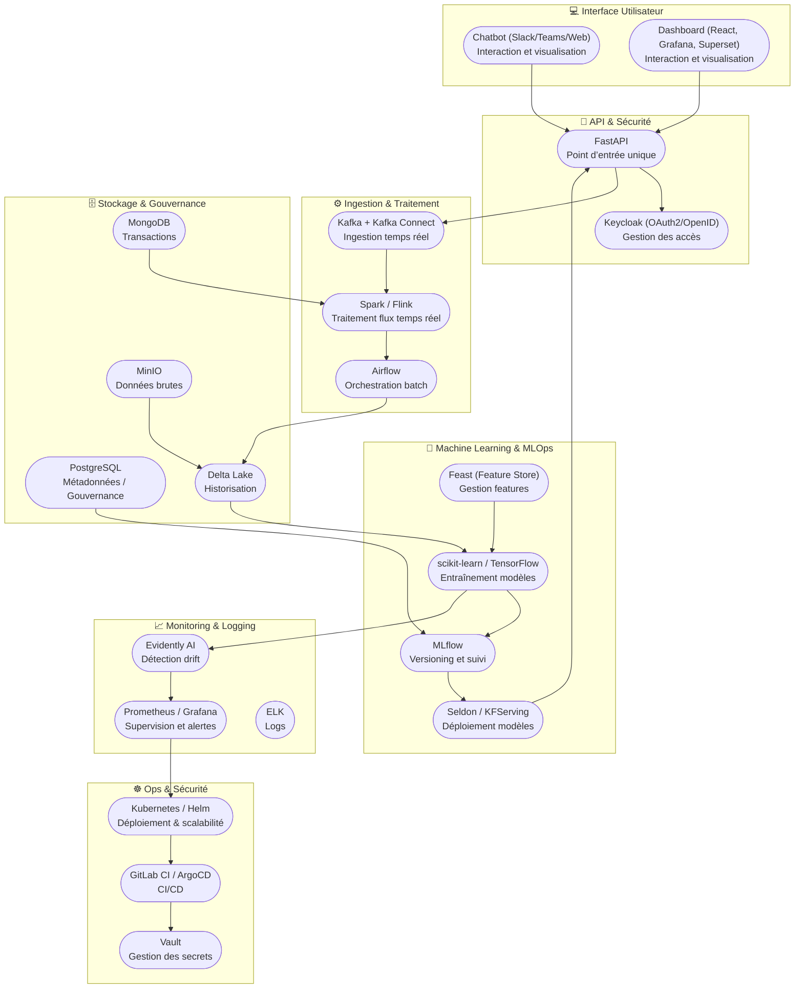

# 🏦 Plateforme de Scoring Automatiser avec MLOps Complet --> Toutes En Un (File Rouge)

## 📌 Contexte
Ce projet vise à concevoir et déployer une **plateforme de scoring automatisé** capable de :
- ✅ Évaluer le **risque de crédit** (scoring prospects / candidats RH).  
- 🔍 Détecter les **anomalies** et comportements atypiques dans les transactions.  
- 🛡️ Détecter les **fraudes en temps réel** (streaming & ML).  
- 💰 Anticiper l’approvisionnement des distributeurs automatiques (logistique).  
- 📊 Automatiser la génération de **rapports** et la **gestion de la conformité** (KYC / AML).  
- 💬 Intégrer un **chatbot intelligent** pour interagir avec la plateforme.  

🎯 **Objectif** : disposer d’un système **scalable, automatisé, traçable et conforme** aux bonnes pratiques **MLOps**.

---

## 🏗️ Architecture Technique

| Couche | Composants | Rôle |
|--------|------------|------|
| **Interface Utilisateur** | Chatbot (Slack/Teams/Web), Dashboard (React, Grafana, Superset) | Interaction et visualisation |
| **API & Sécurité** | FastAPI, Keycloak (OAuth2/OpenID) | Point d’entrée unique, gestion des accès |
| **Ingestion & Traitement** | Kafka + Kafka Connect, Spark/Flink, Airflow | Ingestion temps réel, orchestration batch |
| **Stockage & Gouvernance** | MinIO, PostgreSQL, MongoDB, Delta Lake | Données brutes, historisation, gouvernance |
| **Machine Learning & MLOps** | scikit-learn/TensorFlow, MLflow, Seldon, KFServing, Feast (Feature Store) | Entraînement, versioning, déploiement |
| **Monitoring & Logging** | Prometheus, Grafana, ELK, Evidently AI | Supervision, alertes, détection drift |
| **Ops & Sécurité** | Kubernetes, Helm, GitLab CI/ArgoCD, Vault | Déploiement, scalabilité, gestion secrets |


---

## 🔑 Epics & Use Cases

| Epic | Cas d’usage | Algorithmes | KPIs |
|------|-------------|-------------|------|
| **1. Scoring crédit** | Prédiction défaut/non défaut | Logistic Regression, XGBoost | AUC > 0.85, F1-score équilibré |
| **2. Détection anomalies** | Transactions atypiques | Isolation Forest, Autoencoders | > 90% précision, < 10% faux positifs |
| **3. Fraude temps réel** | Streaming transactions | Supervised ML + règles | Latence < 500ms, Recall > 95% |
| **4. Approvisionnement distributeurs** | Prévision cash | ARIMA, Prophet, LSTM | Rupture < 3%, coûts optimisés |
| **5. Automatisation** | Rapports & RBAC | Airflow, FastAPI, PDFKit | 100% automatisation, < 1 min |
| **6. Conformité** | KYC & AML | OCR + API externes | Conformité Bâle III, GDPR |

---

## 🚀 User Stories (extraits)

- 👨‍💻 *En tant que Data Engineer*, je veux connecter les sources (CRM, transactions, API) pour centraliser les données.  
- 📊 *En tant qu’analyste*, je veux des pipelines fiables pour ingérer et transformer les données.  
- 🤖 *En tant que Data Scientist*, je veux entraîner un modèle de scoring crédit pour évaluer le risque.  
- 🧑‍💻 *En tant que développeur*, je veux exposer les scores via une API REST.  
- 🗣️ *En tant qu’utilisateur*, je veux interagir avec la plateforme via un tableau de bord et un chatbot.  
- 🛡️ *En tant que responsable conformité*, je veux que le système respecte GDPR/KYC.  
- 🔍 *En tant qu’admin*, je veux surveiller la performance des modèles et APIs.  

---

## 📅 Planification (Kanban / Jira)

| Phase | Durée | Livrables |
|-------|-------|-----------|
| **1. Cadrage & setup** | 2 semaines | Specs, environnement dev |
| **2. MVP Scoring crédit** | 4 semaines | Modèle ML, API scoring |
| **3. Détection anomalies/fraudes** | 4 semaines | Pipelines + streaming ML |
| **4. Automatisation & conformité** | 4 semaines | Rapports auto, RBAC, KYC |
| **5. Intégration Chatbot & dashboards** | 2 semaines | Chatbot interactif, UI |
| **6. Optimisation & scalabilité** | Continu | Monitoring, CI/CD, Kubernetes |

---

## ⚙️ Installation & Prérequis

### 📌 Dépendances principales (on-premise)
- **Langage** : Python 3.10+, Java 11  
- **Data** : PostgreSQL, MongoDB, MinIO  
- **Pipeline** : Kafka, Airflow, Spark  
- **ML & MLOps** : scikit-learn, TensorFlow, MLflow, Seldon  
- **Infra** : Docker, Kubernetes, Helm  
- **Monitoring** : Prometheus, Grafana, ELK  

### 📌 Installation rapide
```bash
# Cloner le repo
git clone https://github.com/votre-org/scoring-mlops.git
cd scoring-mlops

# Créer l’environnement virtuel
python -m venv venv
source venv/bin/activate   # Linux/Mac
venv\Scripts\activate      # Windows

# Installer les dépendances
pip install -r requirements.txt

# Lancer Airflow + Kafka + MLflow avec Docker Compose
docker-compose up -d
```
## 📊 KPIs Globaux
-  Adoption utilisateur > 80%
-  Réduction temps de décision > 70%
-  Amélioration précision prédictions > 20% vs baseline
-  < 5% d’erreurs sur détection fraude
-  Conformité réglementaire auditée ✅

## 📚 Références

- [MLOps - Google Cloud](https://cloud.google.com/architecture/mlops-continuous-delivery-and-automation-pipelines-in-machine-learning)  
  *Guide officiel de Google pour mettre en place un pipeline MLOps complet (CI/CD, monitoring, déploiement).*
  
- [MLflow Documentation](https://mlflow.org/docs/latest/index.html)  
  *Documentation officielle de MLflow pour le suivi des expériences, la gestion des modèles et le déploiement.*
  
- [Apache Airflow](https://airflow.apache.org/docs/)  
  *Guide complet d’Apache Airflow pour l’orchestration des pipelines de données et workflows.*  

- [Kafka Quickstart](https://kafka.apache.org/quickstart)  
  *Guide d’introduction officiel pour installer, configurer et utiliser Apache Kafka.*  

- [MLOps Crash Course (YouTube)](https://www.youtube.com/watch?v=06-AZXmwHjo)  
  *Cours accéléré sur MLOps : bonnes pratiques, CI/CD, monitoring et mise en production de modèles ML.*  

- [MLOps Zoomcamp (YouTube)](https://www.youtube.com/playlist?list=PL3MmuxUbc_hJed7dXYoJw8DoCuVHhGEQb)  
  *Programme complet et pratique pour apprendre MLOps étape par étape (DataTalksClub).*  

- [Kafka Fundamentals (YouTube)](https://www.youtube.com/watch?v=UEg40Te8pnE)  
  *Vidéo d’introduction aux fondamentaux d’Apache Kafka (streaming, topics, producteurs/consommateurs).*  

- [Evidently AI (Drift Monitoring)](https://docs.evidentlyai.com/)  
  *Documentation d’Evidently AI pour surveiller le drift des données et la performance des modèles ML.*  
